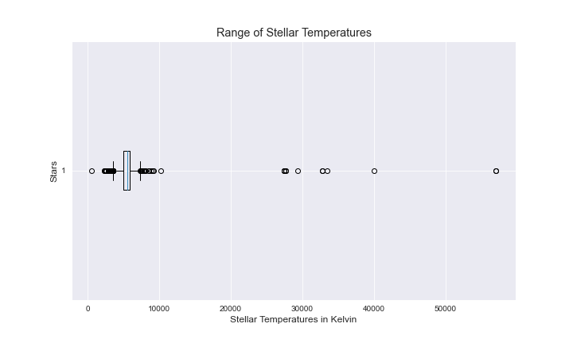
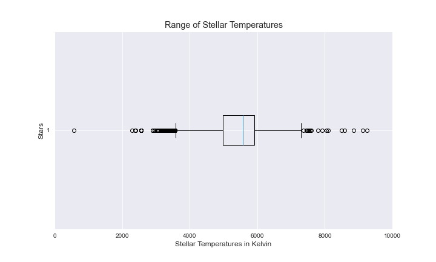
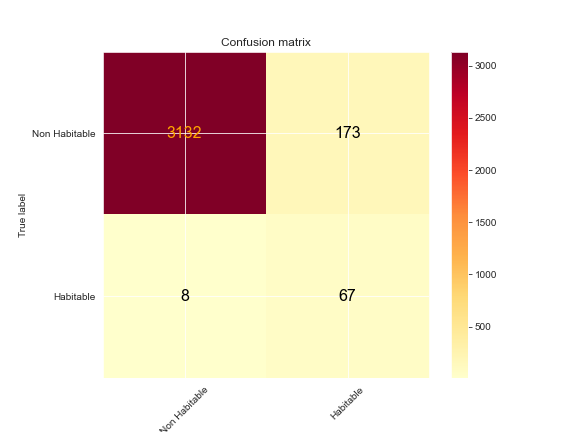
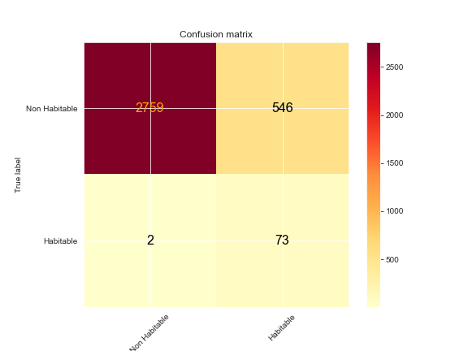

# Habitable Zone Detection
## Binary Classifcation of whether exoplanet lives within the habitable zone

Author: [Rafael Ferreira](https://github.com/Astroraf)

 

## Overview 
As the field of astronomy and astrophysics progresses, so does the instrumentation that these scientist are using. Over the course of 25 years, we have disovered upwards to 4,000 known exoplanets orbiting other stars within the Milky Way Galaxy. The means of detection varies from instrument to instrument, with the most common detection techniques being the transit method, when the planet goes in front of its host star, showing a dip in brightness over a period of time. Radial Velocity, uses the host star slight movement caused by the push and pull of the exoplanet(s) that orbit the star. The last well known dection is direct imaging, but is not widely used until we have better instrumentation like the James Webb Telescope, yet to be realeased into space. When using any of these three techniques, the main focus is detecting what exoplanets live within the habitable zone. That is where liquid water can exist at temperatures between 273 K, the freezing point of water, and 373 K, the boiling point of water. Where liquid water or the habitable zone exist in other solar systems all depends on the type of host star. The more luminous stars have habitable zones that are push farther out then compared to stars with lower lumnosities. My sole focus is determing wether the exoplanets that where discovered and archive in the [NASA database](https://exoplanetarchive.ipac.caltech.edu/cgi-bin/TblView/nph-tblView?app=ExoTbls&config=PSCompPars) fall within the habitable zone. Once the planets are determined to live within the habvitable zone, more research can be done if these planets are terrestial or gaseous planets, with the potential of humans exploring these exoplanets one day for humans to live. 

 

## Approach 

1. **Cleaning and Preprocessing:** Handled all missing information for the characteristics of the host stars and exoplanets, dropped unneeded/unsuable columns, and prepared models in ways necessary for modeling. 

2. **Exploratory Data Analysis:** Database was cleaned, then features created to create a plethora of visuals in order to better understand the distribution of host stars, types of exoplanets, and the class imbalance that occurs between planets that are within the habitable zone. 

3. **Modeling:** Tested several classification models to find the best best option for the NASA dataset

4. **Evaluation:** Evaluated the models test for the best results and made a determination about each finding. 

5. **Fine tuned model:** Tuned the best model for hyperparamters for best F1 and Recall Score

6. **Present Findings:** Present findings to an audience and future works

7. **Launch, monitor, and maintain the system:** Add new exoplanets to machine learning model and monitor results 

 

### Models Tested:

> * RandomForest
> * Xgboost
> * DecisionTree
> * LightGBM
> * SVC
> * KNearestNeighbor

## Analysis 

The first step in the project was to explore the dataset from the NASA archive. What I found was what I was expecting in terms of the type of stars that produce exoplanets and the number of planets that exist within the habitable zone. Most of the stars that are producing exoplanets are around the range from F to M type stars. These stars allow for exoplanets to easily exist and are much more suitable to allow for a habitable zone to exist for liquid water to arise due to the habitable zone range that exist because of these host stars, as well as the time scale that they enable for exoplanets to form.  

 

Taking a closer look at the distrubtion of host stars, we can see that a large majority of exoplanets exist with a G type host star like our own. This enables astronomers to search for G type stars within our own Milky Way Galaxy, which would most likely give was to exoplanets with habitable zones. 

 

Another aspect of the data was finding the huge class imbalance that exist between the number of exoplanets that live within the habitable zone, and that live outside their habitable zone. Under what we know about life, it seems reasonable to understand that there are far fewer exoplanets that live within habitable zone. Dealing with this class imbalance, I use resampling to over sample the minority class, and undersample the majority class. 

 

One more aspect I took a closer look was the range of stellar temperatures in terms of the mean, median, and mode of the stellar effective surface temperatures. We can see there are some outliers of host stars that have exoplanets. This is usally quite uncoommon for thesee types of stars to have exoplanets because of their short lifespans, and inability to enable exoplanets to form over such a short time scale. 

Range Stellar Temperatures w/ Outliers             |  Range of Stellar Temperatures without Outliers
:-------------------------------------------------:|:-------------------------:
  |  

# Modeling

In my evaluation of the models, I used F1 score and Recall as the main evalatuion metrics for th this project. My baseline models were Logsitic Regression, Random Forest, XGBoost, LightGBM, and SVC that were applied to the processed data. With such a huge class imbalance I utlizied over weighting the minority class, under weighting the minority class. The best results from the base models were RandomForest and XGBoost with F1 scores and Recall scores of 0.39, 0.76, and 0.41, 0.40 respectively. The next step was to run gridsearch the top models fine tuning the hyperparameters. 

After running gridsearch on all the top models, running the normal data set, over train model, under trained model with both having poly features LightGBM and Xgboost were my top models with the best recall and F1 scores.

LightGM with Over fitting minority class                  |  Xgboost Over fitting minority class                              | XgBoost Under Wegihting Majority Class
:--------------------------------------------------------:|:-----------------------------------------------------------------:|:----------------------------
|    | 

Below are the stats of the three best models. In regards to focusing more on detecting habitable planets, which was my minority class, Xgboost with the under weighting of the majority class out performed all other models, but interms of having a balance between F1 Score and Recall Score, LightGBM with over weighting the minority class did the best. 

 

## Conclusion

With what we know how scarce life is, being that we are the only known planet to have life on it, it is reasonable to realize that fewer planets that we disover will be within the habitable zone. Upon the first analysis, I see that we have a mjority of the habitable planets coexisting around F to M type stars which would make sense given our own solar system. Our host star is of a G type star, which is part of the main sequence type stars. These stars enable for exoplanets to survive the formation process and allow for life to arise due to the time scale that these stars and exoplanets are able to exist without major disruption. 

After running the cleaned data through multiple binary classfication models, LightGBM had a F1 score performance of 0.42 and a Recall score of 0.89. LightGBM did an exceptional job in terms of Recall due to the large class imbalance that existed with the number of habitable exoplanets and the number of nonhabitable exoplanets that existed. Xgboost does a very good job at recall with an recall score of 0.97 which if I was solely focusing on, I would go with Xgboost model. 

## Future Steps
My next steps for this classification project would to consider the albedo affect on each exoplanet, which is the anount of radiation that is asbored and reflected by each exoplanet. This allows for certain areas on the exoplanet to allow for liquid water to exist, where other areas are far to hot or cold for liquid water to exist. Another step is to gather over 20,000 observations of exoplanets to then use Neural Networks to make the best possible predictions on exoplanets living within the habitable zone. 

## Repository Structure
    
    ├── Notes/Data ├── Data                                            All csv files
                   ├── Notebooks ├──data_cleaning                      Cleaned all data, created all features, and target column
                                 ├── EDA                               Created Visuals to explore the data
                                 ├── Modeling                          Notebook of all models attempted with GridSearchCV
    ├── images                                                         Images
    ├── README.md                                                      ReadMe
    └── presentation_deck                                              Contains the presentation deck associated with this project

## Sources
1. [Data](https://exoplanetarchive.ipac.caltech.edu/cgi-bin/TblView/nph-tblView?app=ExoTbls&config=PSCompPars)
2. [Spec Type Temps](https://sites.uni.edu/morgans/astro/course/Notes/section2/spectraltemps.html)
3. [Habitable Zone](https://www.planetarybiology.com/calculating_habitable_zone.html)
4. [Feature Description](https://exoplanetarchive.ipac.caltech.edu/docs/API_exoplanet_columns.html)
5. [Stellar Radius](https://www.enchantedlearning.com/subjects/astronomy/stars/startypes.shtml)
6. [Luminosity Equation](http://www.astronomy.ohio-state.edu/~thompson/1144/Lecture9.html#:~:text=L%20%3D%20F%20x%20Area%20%3D%204,2%20%CF%83SB%20T4&text=%22%20The%20Luminosity%20of%20a%20star,power%20and%20its%20Radius%20squared.%22)
7. [Kepler Equation](https://www.vanderbilt.edu/AnS/physics/astrocourses/ast201/keplerslaws_3.html)
8. [Habitable Zone Paper](https://www.astro.umd.edu/~miller/teaching/astr380f09/lecture14.pdf)
9. [Host Stars Database](http://www.exoplanetkyoto.org/exohtml/A_All_HostStars.html)
